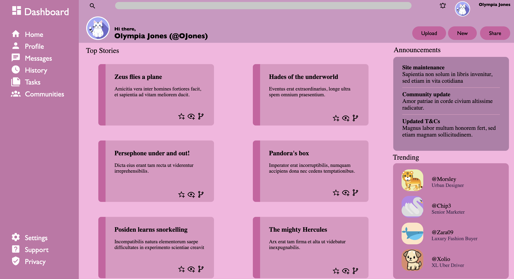

# CSS and HTML Admin Dashboard
I created a lovely Admin Dashboard using HTML & CSS only. This project is designed to showcase how to create a structured dashboard interface without using JavaScript or external libraries.

# Key features
- Stylish, pink colour scheme 
- CSS Flexbox and Grid layouts for responsive design

# Technologies Used
- HTML5
- CSS3 (Flexbox & Grid)

# Credits
- My design was inspired by The Odin Project's Admin Dashboard project.
- Icons were taken from Material icons
## Icons Credits
- The "Cute Dog" icon used in this project is created by [IconArchive](https://www.iconarchive.com/show/cute-animal-icons-by-iconarchive/Cute-Dog-icon.html).
- The "Tiger" icon used in this project is created by [Google](https://www.iconarchive.com/show/noto-emoji-animals-nature-icons-by-google/22224-tiger-icon.html).
- The "Whale" icon used in this project is designed by [Freepik](https://www.freepik.com/icon/whale_146676). 
- The "Swan" icon used in this project is created by [Freepik](https://www.flaticon.com/free-icon/swan_166711).
- The "Cute Cat" avatar used in this project is created by [Vecteezy](https://www.vecteezy.com/photo/34639180-ai-generated-cute-cat-avatar-icon-clip-art-sticker-decoration-simple-background).

# Screenshot
Here is a preview of the Admin Dashboard

